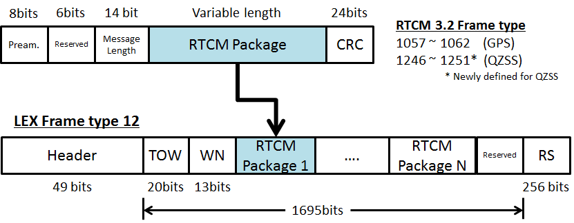

# 模拟接收机


## 项目结构

```txt
.
├── CMakeLists.txt
├── CRC24Q.cpp
├── CRC24Q.h
├── Config.h
├── Deserializer.h
├── config.xml
├── guide.cpp
├── main.cpp
├── test.cpp
└── test.h
```

* CRC24Q实现CRC24算法，主要用于收到数据帧后检验完整性
* Config类，读取XML配置文件，设置client的重要连接属性
* Deserializer类，反序列化逻辑的具体实现
* config.xml，配置文件，与可执行文件放到相同目录，根据具体场景调优，建议启用clean session
* guide.cpp，paho.mqtt.cpp官方提供的样例代码，版本为1.5.2(安装可能会出现CXX11_ABI兼容性问题)
* main.cpp，启动入口
* test，测试工具，测试CRC24算法、Deserializer类的正确性
* 依赖tinyxml2，版本11.0.0

## 帧结构



## 实际运行

上游数据源


本用户


数据解析结果正确，端到端延迟大概在200ms，满足要求

不带内存管理操作系统的单片机，使用嵌入式版本，https://github.com/eclipse-paho/paho.mqtt.embedded-c
